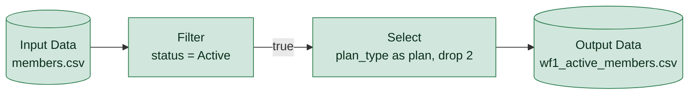

# Lineage: wf1_active_members.yxmd

Colors show migration difficulty: red = high, yellow = medium, green = low, grey = nothing to migrate.

```mermaid
flowchart LR
    t1[("Input Data<br/>members.csv")]
    t2["Filter<br/>status = Active"]
    t3["Select<br/>plan_type as plan, drop 2"]
    t4[("Output Data<br/>wf1_active_members.csv")]
    t1 --> t2
    t2 -->|true| t3
    t3 --> t4
    classDef high fill:#f8d7da,stroke:#b02a37,color:#3d0a10
    classDef medium fill:#fff3cd,stroke:#b8860b,color:#3d2e00
    classDef low fill:#d1e7dd,stroke:#2e7d4f,color:#0b2e1c
    class t1,t2,t3,t4 low
    classDef none fill:#e9ecef,stroke:#6c757d,color:#212529
```
