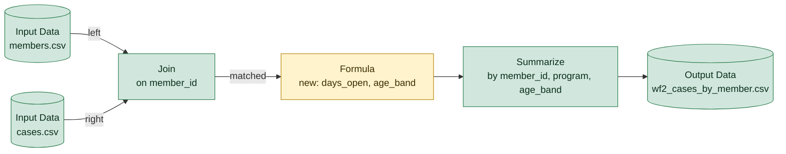

# Lineage: wf2_cases_by_member.yxmd

Colors show migration difficulty: red = high, yellow = medium, green = low, grey = nothing to migrate.

```mermaid
flowchart LR
    t1[("Input Data<br/>members.csv")]
    t2[("Input Data<br/>cases.csv")]
    t3["Join<br/>on member_id"]
    t4["Formula<br/>new: days_open, age_band"]
    t5["Summarize<br/>by member_id, program, age_band"]
    t6[("Output Data<br/>wf2_cases_by_member.csv")]
    t1 -->|left| t3
    t2 -->|right| t3
    t3 -->|matched| t4
    t4 --> t5
    t5 --> t6
    classDef high fill:#f8d7da,stroke:#b02a37,color:#3d0a10
    classDef medium fill:#fff3cd,stroke:#b8860b,color:#3d2e00
    class t4 medium
    classDef low fill:#d1e7dd,stroke:#2e7d4f,color:#0b2e1c
    class t1,t2,t3,t5,t6 low
    classDef none fill:#e9ecef,stroke:#6c757d,color:#212529
```
