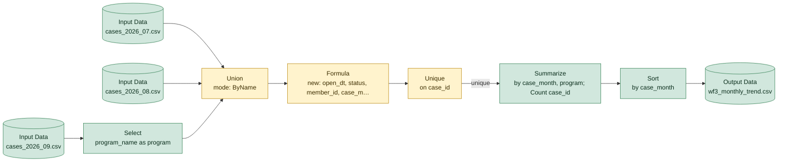

# Lineage: wf3_monthly_trend.yxmd

Colors show migration difficulty: red = high, yellow = medium, green = low, grey = nothing to migrate.

```mermaid
flowchart LR
    t1[("Input Data<br/>cases_2026_07.csv")]
    t2[("Input Data<br/>cases_2026_08.csv")]
    t3[("Input Data<br/>cases_2026_09.csv")]
    t4["Select<br/>program_name as program"]
    t5["Union<br/>mode: ByName"]
    t6["Formula<br/>new: open_dt, status, member_id, case_m…"]
    t7["Unique<br/>on case_id"]
    t9["Summarize<br/>by case_month, program; Count case_id"]
    t10["Sort<br/>by case_month"]
    t11[("Output Data<br/>wf3_monthly_trend.csv")]
    t1 --> t5
    t2 --> t5
    t4 --> t5
    t3 --> t4
    t5 --> t6
    t6 --> t7
    t7 -->|unique| t9
    t9 --> t10
    t10 --> t11
    classDef high fill:#f8d7da,stroke:#b02a37,color:#3d0a10
    classDef medium fill:#fff3cd,stroke:#b8860b,color:#3d2e00
    class t5,t6,t7 medium
    classDef low fill:#d1e7dd,stroke:#2e7d4f,color:#0b2e1c
    class t1,t2,t3,t4,t9,t10,t11 low
    classDef none fill:#e9ecef,stroke:#6c757d,color:#212529
```
