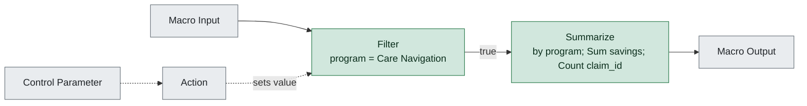

# Lineage: wf4_program_summary.yxmc

Colors show migration difficulty: red = high, yellow = medium, green = low, grey = nothing to migrate.

```mermaid
flowchart LR
    t3["Filter<br/>program = Care Navigation"]
    t6["Summarize<br/>by program; Sum savings; Count claim_id"]
    t2["Macro Input"]
    t4["Control Parameter"]
    t5["Action"]
    t7["Macro Output"]
    t3 -->|true| t6
    t6 --> t7
    t2 --> t3
    t5 -.->|sets value| t3
    t4 -.-> t5
    classDef high fill:#f8d7da,stroke:#b02a37,color:#3d0a10
    classDef medium fill:#fff3cd,stroke:#b8860b,color:#3d2e00
    classDef low fill:#d1e7dd,stroke:#2e7d4f,color:#0b2e1c
    class t3,t6 low
    classDef none fill:#e9ecef,stroke:#6c757d,color:#212529
    class t2,t4,t5,t7 none
```
