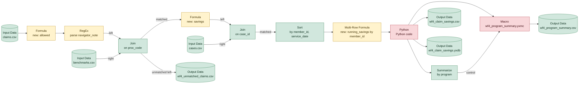

# Lineage: wf4_savings_report.yxmd

Colors show migration difficulty: red = high, yellow = medium, green = low, grey = nothing to migrate.

```mermaid
flowchart LR
    t1[("Input Data<br/>claims.csv")]
    t2["Formula<br/>new: allowed"]
    t3["RegEx<br/>parse navigator_note"]
    t5[("Input Data<br/>benchmarks.csv")]
    t6["Join<br/>on proc_code"]
    t8["Formula<br/>new: savings"]
    t9[("Input Data<br/>cases.csv")]
    t10["Join<br/>on case_id"]
    t11["Sort<br/>by member_id, service_date"]
    t12["Multi-Row Formula<br/>new: running_savings by member_id"]
    t13["Python<br/>Python code"]
    t16["Macro<br/>wf4_program_summary.yxmc"]
    t17["Summarize<br/>by program"]
    t7[("Output Data<br/>wf4_unmatched_claims.csv")]
    t14[("Output Data<br/>wf4_claim_savings.csv")]
    t15[("Output Data<br/>wf4_claim_savings.yxdb")]
    t18[("Output Data<br/>wf4_program_summary.csv")]
    t1 --> t2
    t2 --> t3
    t3 -->|left| t6
    t5 -->|right| t6
    t6 -->|unmatched left| t7
    t6 -->|matched| t8
    t8 -->|left| t10
    t9 -->|right| t10
    t10 -->|matched| t11
    t11 --> t12
    t12 --> t13
    t13 --> t14
    t13 --> t15
    t13 --> t17
    t13 --> t16
    t17 -->|control| t16
    t16 --> t18
    classDef high fill:#f8d7da,stroke:#b02a37,color:#3d0a10
    class t13,t16 high
    classDef medium fill:#fff3cd,stroke:#b8860b,color:#3d2e00
    class t2,t3,t8,t12 medium
    classDef low fill:#d1e7dd,stroke:#2e7d4f,color:#0b2e1c
    class t1,t5,t6,t9,t10,t11,t17,t7,t14,t15,t18 low
    classDef none fill:#e9ecef,stroke:#6c757d,color:#212529
```
